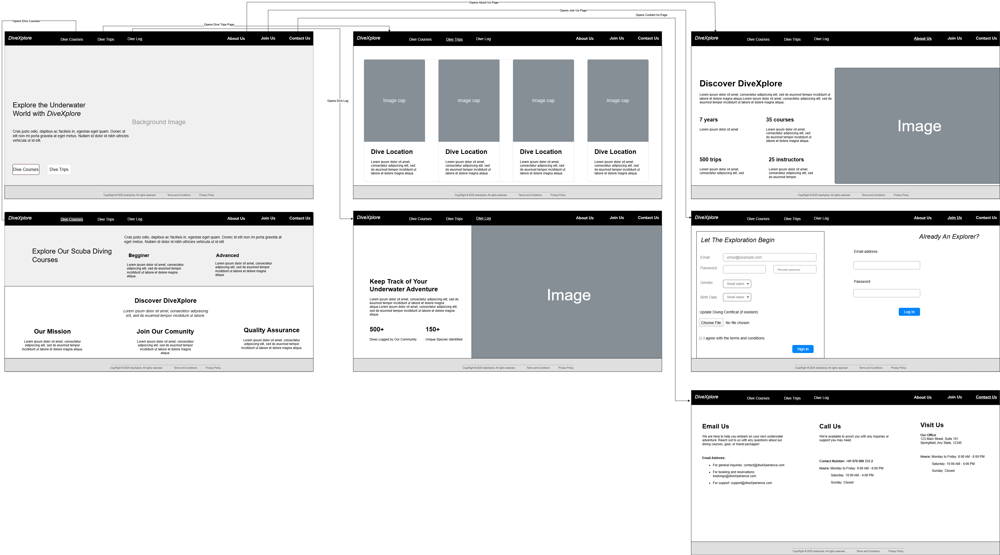

# OceanDive

A website that offers dive courses, trips, and digital dive logs, designed to
meet the requirements of the **Internet Technology module** at
**FHNW**.

<!-- TOC -->
* [OceanDive](#oceandive)
  * [Analysis](#analysis)
    * [Scenario](#scenario)
    * [User Stories](#user-stories)
      * [Admin User Stories](#admin-user-stories)
      * [Guest stories (non-registered users)](#guest-stories-non-registered-users)
      * [Registered User Stories](#registered-user-stories)
    * [Use Case Diagram](#use-case-diagram)
  * [Design](#design)
    * [Wireframe Design](#wireframe-design)
    * [Prototype Design](#prototype-design)
    * [Domain Design](#domain-design)
    * [Business Logic](#business-logic)
  * [Implementation](#implementation)
    * [Backend Technology](#backend-technology)
    * [Frontend Technology](#frontend-technology)
  * [Execution](#execution)
    * [Deployment to a Paas](#deployment-to-a-paas)
  * [Project Management](#project-management)
    * [Roles](#roles)
    * [Milestones](#milestones)
  * [Maintainers](#maintainers)
  * [Contributors](#contributors)
  * [Note](#note)
<!-- TOC -->

## Analysis

### Scenario

As a team, we designed the website OceanDive that offers dive courses,
dive trips, and additional service “digital dive log.”
A new user visits the website as a guest, browses available dive courses, and
books a course without a mandatory login. Similarly, guests can explore and book
dive trips without needing an account. Users are prompted to choose a valid
option of the dive certifications provided on the web when booking "dive trips
or advanced courses" or being non-divers otherwise, ensuring only qualified
divers can participate.

Users can optionally create an account to access the digital dive log service,
where they securely log dive details (dive number, dive date, dive location, air
temperature,
surface temperature, dive start time & end time, dive max depth and notes). Once
registered, they can view and/or edit their dive logs by adding, updating, or
deleting entries. Additionally, users can delete their accounts.

On the administrative side, admins manage the platform by adding/updating
courses, trips, and general content. They adjust trip availability and maintain
user accounts (deactivating suspicious accounts or resetting passwords).
User autonomy is prioritized: divers retain full control over their data,
including the ability to delete dive logs permanently.

### User Stories

#### Admin User Stories

1. As an admin, I want to add, update, and delete dive courses and trips so that
   the platform stays up to date.
2. As an admin, I want to manage trip availability so that users see only
   currently available trips.
3. As an admin, I want to edit website content (Terms and Conditions,
   Privacy Policies) to keep information accurate and relevant.
4. As an admin, I want to manage user accounts (deactivate suspicious
   accounts, reset passwords) so that I can maintain platform security.
5. As an admin, I want to ensure users retain full control over their dive logs
   so that they can delete or modify their entries at any time.

#### Guest stories (non-registered users)

1. As a guest, I want to browse available dive courses and trips without logging
   in so that I can explore options freely.
2. As a guest, I want to book a dive course or trip without needing an account
   so that I can make quick reservations.

#### Registered User Stories

1. As a user, I want to select a valid dive certification when booking diving
   trips or advanced courses so that I can comply with safety requirements.
2. As a user, I want to select "non-diver" when booking trips or dive courses.
3. As a user, I want to create an account so that I can securely store my dive
   logs.
4. As a user, I want to log in so that I can access my saved dive logs and
   personal details.
5. As a user, I want to view, update, or delete my dive logs so that I can
   manage my records efficiently.
6. As a user, I want to delete my account so that I have full control over my
   data.

### Use Case Diagram

Use Case Diagram illustrating OceanDive Web Application system interactions.

---

1. UC-1 [Create Account] – A user creates an account to access personalized
   features.
2. UC-2 [Login] – A user logs into the system.
3. UC-3 [Manage Dive Log (View, Update, Delete)] – A user can view, update, or
   delete their dive logs.
4. UC-4 [Book Dive Trip] – A guest or user books a dive trip.
5. UC-5 [Select Dive Certification (or No Certification)] – A user must select a
   valid dive certification when booking trips.
6. UC-6 [Book Dive Course] – A guest or user books a dive course.
7. UC-7 [Browse Courses & Trips] – A guest or user can browse available dive
   courses and trips.
8. UC-8 [Delete Account] – A user deletes their account.
9. UC-9 [Manage Courses & Trips (Add, Update, Delete)] – An admin manages
   courses and trips.
10. UC-10 [Manage Trip Availability] – An admin updates trip availability.
11. UC-11 [Manage User Accounts] – An admin manages user accounts.
12. UC-12 [Ensure User Data Control] – Ensures users can manage and control
    their data.

## Design

<!-- Repo Owner Notes: 
 Keep in mind the Corporate Identity (CI); you shall decide appropriately the color schema, graphics, typography, layout, UserEntity Experience (UX), and so on. -->

### Wireframe Design

<!-- Repo Owner Notes:
It is suggested to start with a wireframe. The wireframe focuses on the website structure (Sitemap planning), sketching the pages using Wireframe components (e.g., header, menu, footer) and UX. You can create a wireframe already with draw.io or similar tools.-->

### Prototype Design

<!-- Repo Owner Notes:
A prototype can be designed using placeholder text/figures in Budibase. You don't need to connect the front-end to back-end in the early stages of the project development.
-->

### Domain Design

<!-- Repo Owner Notes:
Provide a picture and describe your domain model; you may use Entity-Relationship Model or UML class diagram. Both can be created in Visual Paradigm - we have an academic license for it.
The ch.fhnw.pizza.data.domain package contains the following domain objects / entities including getters and setters:
-->

### Business Logic

## Implementation

### Backend Technology

### Frontend Technology

## Execution

### Deployment to a Paas

## Project Management

### Roles

### Milestones

## Maintainers

- Iulia Mara Udrea
- Mehak Khan
- Sameh Ahmed

## Contributors

- Charuta Pande
- Devid Montecchiari

---

## Note

*Built for learning, not profit — but hey, maybe one day? 🌟*

*P.S. Open to feedback! We’re still students, after all.*